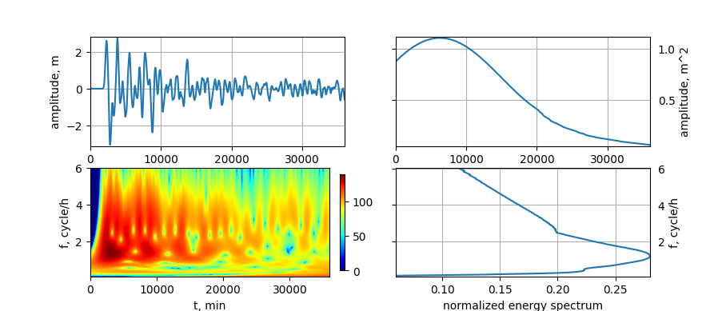

# Wave Spectrum Analysis

This project allows wave researchers to build energetic and wave specifications of waves.
The project contains the implementation of the impulse response 
of the complex Gaussian filter for building wavelet-like transformation and specifications built on this transform.

## Input data
The most useful characteristics in the spectrum analysis of tsunamis are energy, power, and intensity.
To build these characteristics usually use data of tsunami amplitude after numerical modeling.
Wave Spectrum Analysis can process amplitude data in a specific format:
```text
0 0
20 0
40 1.96846e-123
...
34380 0.0351646
...
35340 -0.585097
...
36000 -0.588755
```
The first column is time in seconds. The second column is amplitude of thw wave in meters.

# Plot characteristics

Using Wave Spectrum Analysis you can build plots of amplitude,energy, power, and intensity:



To build wavelet-like transformation for your signal you should create the instance of `WaveletTransformer`:
```py

from python.signal_processer.wavelet_transformer.wavelet_transformer import WaveletTransformer

w_t = WaveletTransformer ()
```
